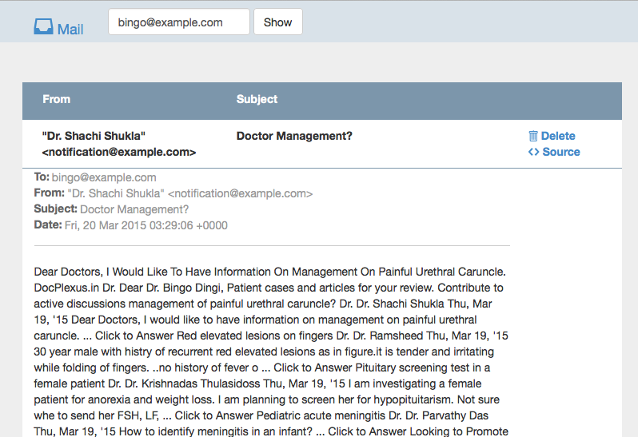

# self-hosted disposable email system

This disposable email solution can be hosted on your own standard PHP-webhoster. All you need is PHP with mailparse extension and "Pipe to a Program" functionality. The system is as simple as possible, with minimal codebase and complexity. 

Note: there is also an IMAP version without database and that does not need "pipe to command". https://github.com/synox/disposable-email-imap

## Usage
When accessing the web-app a random email address is generated for you. The page will reload until emails have arrived. You can delete emails and see the original sourcecode. 

### Example Screenshot

## Licence
Attribution-NonCommercial 4.0 International (CC BY-NC 4.0)

https://creativecommons.org/licenses/by-nc/4.0/

## Requirements

* PHP, Version 5.3.0
* Apache 2
* [mailparse extension](http://pecl.php.net/package/mailparse)
* [Composer](https://getcomposer.org/doc/00-intro.md#globally) (PHP Package Manager)

## Installation

- Clone/download this repository 
- assure the mailparse extension is installed. The following command should not print any error: 
  
        <?php mailparse_msg_create(); ?>

## Configuration
- forward/pipe email to the php script `app/pipe_input.php` (e.g.  [cpanel](https://documentation.cpanel.net/display/ALD/Forwarders#Forwarders-PipetoaProgram) docs)
- (optionally) configure a different database like mysql in `app/config.php`
- (optionally) configure the link redirection provider (to keep the existence of your installation secret) in `app/config.php`
 
## TODO
 1. security audit against xss/sqli

## development environment
There is a Vagrantfile to be used with [vagrant](https://www.vagrantup.com/). 

### OSX dependencies 
- install php: https://github.com/Homebrew/homebrew-php
- add php to path: fish config: `set PATH /usr/local/opt/php55/bin $PATH`
-  `pecl install mailparse`
- (see "php --ini" for file: ) `echo "extension=mailparse.so" >> /usr/local/etc/php/5.5/php.ini`

## See also
 - inspired by script: https://github.com/moein7tl/TempMail/blob/master/web/index.php
     

